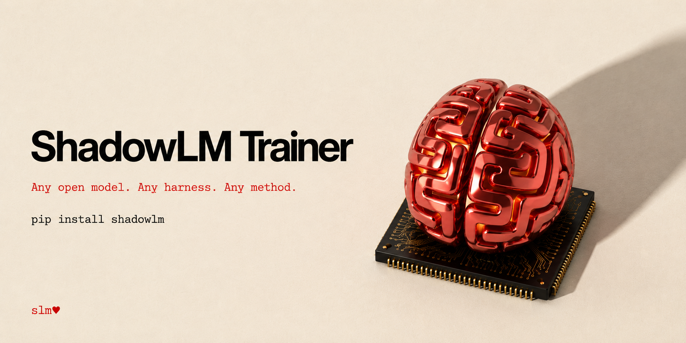

<p align="center">
  
</p>

<p align="center">
  
  
  
  
</p>

<details>
  <summary>Table of contents</summary>

- [Why ShadowLM Trainer](#why-shadowlm-trainer)
- [Backends](#backends)
- [Training methods](#training-methods)
- [Install & run](#install--run)
- [The shadow accelerator](#the-shadow-accelerator)
- [Training parameters](#training-parameters)
- [API surface](#api-surface)
- [Layout](#layout)
- [The road ahead](#the-road-ahead)
- [License](#license)

</details>

# ShadowLM Trainer

**A fine-tuning SDK. Any open model. Any harness. Any method.**

```bash
pip install 'shadowlm[all]'      # the full package — every dependency included
pip install shadowlm             # core SDK only (zero dependencies)
```

```python
import shadowlm as slm

ds    = slm.Dataset.from_jsonl("data.jsonl").as_chat()       # datasets
model = slm.load("mlx-community/Qwen2.5-0.5B-Instruct-4bit",  # load
                 accelerator="shadow")
run   = model.finetune(ds, method="lora", max_steps=60)      # finetune
print(run.loss, run.sparkline())                             # live metrics
print(model.generate("What is the capital of France?"))      # inference
model.save("out/", fmt="adapter")                            # ship it
```

Change `method="lora"` to `qlora`, `dora`, `full`, `dpo`, `grpo`, `bitfit`,
`prompt`, `adapter`, `more`… and nothing else changes. That's the whole idea.

**Why "shadow"?** Because the model you train here is meant to *shadow* the
frontier model behind your agent: `slm.capture()` records the traffic the big
rented model handles, you fine-tune a small open model on it, run it in the
big one's shadow until it performs identically — then switch, and own the
weights. The SDK is that engine; [ShadowLM Studio](#shadowlm-studio) will run
the full loop.

## Why ShadowLM Trainer

- **Twelve training methods, one argument.** LoRA to full fine-tuning to DPO to
  RL-from-rewards to soft prompts — every technique is a declarative spec the
  backends read. Adding your own is one file.
- **Mixture of Retrieval Experts (`more`)** — ShadowLM's signature method: facts
  fused into attention so the model looks them up instead of hallucinating them
  ([details below](#mixture-of-retrieval-experts--teach-facts-not-vibes)).
- **Agent RL, built in.** Collect multi-step rollouts, score whole episodes with
  an LLM judge, train with DPO or trajectory-level GRPO. No reward math required.
  `slm.capture(model)` turns any OpenAI-compatible harness into trajectories —
  the harness runs unchanged.
- **The shadow accelerator.** One knob (`accelerator="shadow"`) that turns on the
  optimizations that are *safe for your model and hardware* — and logs exactly
  what it enabled. No silent magic.
- **Runs are records.** Every finetune persists status, config, and metrics.
  Terminal loss charts, sparklines, resumable checkpoints, run history that
  survives the process.
- **Honest engineering.** No mock backends, no silently-ignored arguments (the
  mlx backend *tells you* when a torch-only knob doesn't apply), base-model
  requirements enforced with errors that say what to do instead.
- **Pure-stdlib core.** `pip install shadowlm` has zero dependencies; training
  backends are opt-in extras for your hardware.

## Backends

**`torch` (CUDA) is the production backend** — PyTorch + `transformers` + `trl`
+ `peft`, the stack serious training runs on. `mlx` exists so the *same code*
develops fast on an Apple laptop before it ships to a GPU box.

| backend | hardware | engine |
|---------|----------|--------|
| `torch` | **CUDA GPU** (production), or CPU (`device="cpu"`) | `transformers` + `trl` + `peft` — SFT / DPO / GRPO |
| `mlx`   | Apple Silicon | `mlx-lm` — the local dev loop |

`auto` resolves CUDA → `torch`, else Apple Silicon → `mlx`, else `torch` on CPU.
One device knob, no mock fallback. The whole torch path — SFT, DPO, GRPO, eval,
generation — is exercised in CI-style on CPU, so the code a CUDA box runs is
tested code, not blind code.

The pipeline is the standard HuggingFace flow — `datasets` formats and chat
templates, LoRA/QLoRA adapters, chat-template inference.

## Training methods

Each technique lives in its own module under `shadowlm/methods/` as a declarative
spec — backends read the spec (adapter kind, base requirements, data rendering),
never the method name.

| method | what it does | base model | default LR |
|--------|--------------|------------|------------|
| `lora`  | LoRA adapters | either | 2e-4 |
| `qlora` | LoRA adapters, lowest memory | **4-bit required** | 2e-4 |
| `dora`  | weight-decomposed LoRA, often better at low rank | either | 2e-4 |
| `full`  | update every transformer weight | **unquantized required** | 2e-5 |
| `cpt`   | continued pretraining on raw domain text (no chat template) | either | 5e-5 |
| `dpo`   | preference optimization on `{prompt, chosen, rejected}` pairs vs a frozen reference (`beta=0.1`) | either | 5e-6 |
| `grpo`  | RL from reward functions (`reward_fns=[...]`) or collected `TrajectoryGroup`s | either | 5e-6 |
| `more`  | **mixture of retrieval experts** — facts embedded into a frozen index fused into attention; near-zero-hallucination recall (`retrieval_k`, `retrieval_layers`) | either | 1e-4 |
| `bitfit` | train only the bias terms (~0.1% of params) | **unquantized required** | 5e-4 |
| `prompt` | soft prompts — `num_virtual_tokens` learned vectors, model frozen (torch) | either | 5e-3 |
| `ptuning` | p-tuning — prompt embeddings via a small encoder (torch) | either | 5e-3 |
| `adapter` | bottleneck adapter modules after each layer (width = `lora_r`) | either | 1e-4 |

SFT methods train on chat/instruction/text data; `dpo` trains on preference
pairs (the `preference` format, auto-detected from `chosen`/`rejected` columns);
`grpo` trains on `{prompt[, answer]}` rows with your reward functions:

```python
def prefers_blue(prompts, completions, answer, types=None):
    return [1.0 if "blue" in c.lower() else 0.0 for c in completions]

run = model.finetune(rows, method="grpo", reward_fns=[prefers_blue],
                     grpo_group_size=4)
```

On CUDA, dpo/grpo ride on trl (`DPOTrainer` / `GRPOTrainer`); on Apple Silicon
they need `pip install shadowlm[preference]`. ORPO / PPO-style RLHF exist in
the substrates and follow the same `trainer=` slot.

### Mixture of Retrieval Experts — teach facts, not vibes

`more` is for *facts*: each training fact is embedded into a frozen FAISS
index; wrapped attention layers retrieve each token's nearest memories and
attend over them through small trainable projections (plus LoRA for capacity).
The model learns to look facts up instead of hallucinating them, and the index
travels inside the adapter dir — `load(adapter=...)` rebuilds everything
(verified on both backends: exact recall of held-in facts, before and after
reload). Needs `pip install shadowlm[retrieval]`.

### Train any harness without opening the box

Every agent must call a model, so the model API is the one boundary that
always exists. `slm.capture(model)` serves an OpenAI-compatible endpoint
(SSE streaming included; parallel calls serialized safely), records every
call your harness makes, and reconstructs multi-turn episodes (prefix-merged,
branch-safe) into trajectories:

```python
with slm.capture(model) as proxy:            # http://127.0.0.1:8327/v1
    run_my_agent(base_url=proxy.base_url)    # any OpenAI-client harness, unchanged
trajectories = proxy.trajectories()
group = slm.judge_group(slm.TrajectoryGroup(trajectories), judge=judge)
run = model.finetune([group], method="grpo")
```

The async rollout-service tier (gateways, prewarming, fleet-scale trainers)
belongs to the studio.

### Agent RL: trajectories + judge rewards

For multi-step agents, score whole episodes instead of writing reward math:

```python
group = slm.TrajectoryGroup(                 # several attempts at one task
    slm.Trajectory(messages=rollout_messages, reward=0.0) for _ in range(6))
group = slm.judge_group(group, judge=judge_model)   # LLM-as-judge scores 0–1
run = model.finetune(group.to_preference_rows(), method="dpo")
```

`judge_group` asks a judge model to score attempts against a rubric (with a
best/worst ranking fallback that keeps small local judges reliable). Train on
the scored groups two ways: `group.to_preference_rows()` → DPO, or directly —
`model.finetune(groups, method="grpo")` runs advantage-weighted policy
gradient over the trajectories (rewards normalized within each group, loss on
assistant tokens only). Collect on-policy rollouts, score, train, repeat.

### Bring your own method

Base requirements are enforced with clear errors (e.g. `qlora` on a 16-bit model
tells you to load a 4-bit one). Adding a technique is one file:

```python
# shadowlm/methods/my_method.py  (or methods.register(...) at runtime)
from .base import TrainingMethod, register

register(TrainingMethod(
    name="my-method",
    description="LoRA variant with my defaults",
    default_learning_rate=1e-4,
))
```

## Install & run

`pip install 'shadowlm[all]'` gives you everything for a CUDA / CPU box.
Prefer picking parts? Each extra is independent:

| extra | what it adds |
|-------|--------------|
| `[torch]` | training on CUDA / CPU — `transformers` + `trl` + `peft` + `torch` |
| `[mlx]` | the local-dev backend (`mlx-lm`) |
| `[preference]` | dpo / grpo on the mlx backend (`mlx-lm-lora`) |
| `[retrieval]` | the `more` method — fact index (`sentence-transformers`) |
| `[mlx-all]` | everything for the local dev loop |

To run the examples, grab the repo:

```bash
git clone https://github.com/open-gitagent/shadowLM && cd shadowLM
python3 -m venv .venv && source .venv/bin/activate && pip install -e '.[mlx]'
python examples/quickstart.py    # datasets → finetune → inference, end to end
```

No hardware handy? `examples/colab_quickstart.ipynb` runs the same flow on a
free Colab GPU.

Output (mlx backend, a 0.5B model — 3.5 seconds of training):

```
Dataset('sample_dataset', format='chat', rows=8)
before: The capital of France is Paris.
[shadow] enabled: gradient checkpointing
[mlx:gpu] finetuning Qwen2.5-0.5B-Instruct-4bit · lora · 8 examples · 40 iters · lora r=16 on 24 layers · lr 0.0002 (linear, warmup 5)
  [████████████████████████] step   40/40  loss 0.0718  lr 5.00e-05  11.7 st/s  1,048 tok/s
[mlx] done · final loss 0.0718 · adapter ~/.shadowlm/runs/Qwen2.5-0.5B-Instruct-4bit-…

  loss  ▇▆█▇▆▇▇█▅▅▄▅▃▂▃▃▁▂▂▂▁▁▁▁▁▁▁▁▁▁▁▁▁▁▁▁▁▁▁▁  4.2120 → 0.0718
  ♥ succeeded · 40 steps · 3.5s

after: The capital of France is Paris.
```

### CUDA box

```python
model = slm.load("Qwen/Qwen2.5-0.5B-Instruct", backend="torch",
                 accelerator="shadow", load_in_4bit=True)
run = model.finetune(ds, method="qlora", max_steps=60)
model.save("out/", fmt="merged")
```

## The shadow accelerator

`accelerator="shadow"` is ShadowLM's in-house optimization layer. It sits on top of
whichever backend is active and turns on the speed/memory optimizations that are
*safe for the current model and hardware*:

- gradient checkpointing (trade compute for VRAM on bigger models)
- flash-attention-2 (on CUDA, when available)
- a fused optimizer

Modes: `"auto"` (default — enable what helps at the current size), `"shadow"`
(force all on), `"none"` (off). It is honest — it logs exactly what it enabled and
no-ops when an optimization wouldn't help.

## Training parameters

`finetune(**hyperparams)` accepts the full `TrainConfig` surface:

- **adapters** — `lora_r`, `lora_alpha`, `lora_dropout`, `target_modules`
  (`"all"` / `"attention"` / `"mlp"` presets, or explicit names), `use_rslora`*
- **optimization** — `learning_rate` (default per method), `per_device_train_batch_size`,
  `gradient_accumulation_steps`, `warmup_steps` / `warmup_ratio`, `max_steps` /
  `num_train_epochs`, `weight_decay`, `max_grad_norm`*, `lr_scheduler_type`
  (linear / cosine / constant — real schedules on both backends), `optim`*, `seed`
- **data** — `max_seq_length`, `packing`*, `train_on_completions` (mask the prompt,
  learn only on responses — mlx; torch masks via prompt/completion data automatically)
- **logging / checkpoints** — `logging_steps`, `eval_steps` (int, or a 0–1 fraction
  of total steps), `save_steps` (mid-run checkpoints), `resume_from_checkpoint`,
  `report_to`*

\* torch-backend only; the mlx backend logs a note instead of silently ignoring.

## API surface

| Call | What it does |
|------|--------------|
| `slm.Dataset.load(path)` | any supported file by extension (.jsonl/.json/.csv/.parquet) |
| `slm.Dataset.from_jsonl / from_csv / from_json / from_parquet / from_list` | format auto-detected: ChatML (`messages`), ShareGPT (`conversations`), alpaca instruction, raw text — or force with `format=` |
| `slm.Dataset.from_hf(repo, subset=, split=, token=)` | HuggingFace Hub datasets |
| `ds.as_chat()` / `ds.as_text()` | force chat or raw-text format |
| `ds.split(test_size=0.1, seed=0)` | held-out train/eval split → `(train, eval)` |
| `ds[0:100]`, `ds.head()`, `ds.columns`, `len(ds)` | row slicing & inspection |
| `slm.load(name, backend=, accelerator=, device=, load_in_4bit=, adapter=)` | load a model (or attach a trained adapter) |
| `model.finetune(ds, method=<any of 12 — see Training methods>, eval_dataset=ds\|"auto", reward_fns=, on_step=, on_eval=, **hyperparams)` | train; returns a `TrainingRun` (`eval_dataset="auto"` holds out 10%) |
| `model.generate(prompt, ...)` | single-prompt inference |
| `model.chat(messages, tools=...)` → `Reply` | multi-turn chat via the model's chat template; OpenAI-style tool schemas in, parsed `reply.tool_calls` out |
| `model.save(path, fmt="adapter"\|"merged")` | export |
| `run.loss`, `run.eval_loss`, `run.step`, `run.progress`, `run.sparkline()`, `run.checkpoint` | live + final run state |
| `slm.runs.list() / latest() / load(id) / delete(id)` | run history — every finetune persists a `run.json` (status, config, metrics) |
| `run.plot("loss"\|"eval_loss"\|"lr"\|"grad_norm", smooth=, window=, log=, clip=)` | terminal charts — raw dots + EMA overlay, view window, log scale, p95/p99 clip |
| `run.series(name)`, `run.smoothed(weight)` | raw (steps, values) series + EMA — the data feed for any UI chart |

Every run records itself — `succeeded`, `failed` (with the error), or `stopped`
(Ctrl-C) — so history survives the process. Resume any recorded run with
`model.finetune(ds, resume_from_checkpoint=run.checkpoint)`; pass `save_steps=N`
to keep mid-run checkpoints so even interrupted runs are resumable.

Pass `on_step` / `on_eval` to `finetune` to stream `Metric(step, loss, lr, ...)`
as training happens — that's the hook ShadowLM Studio's live charts will use.

### Train / eval split

Hold out a validation set so you can see overfitting, not just training loss:

```python
train, val = slm.Dataset.from_jsonl("data.jsonl").split(test_size=0.2)
run = model.finetune(train, eval_dataset=val, eval_steps=10, max_steps=40)

print(run.loss)              # final train loss
print(run.eval_loss)         # final held-out eval loss
print([(m.step, m.loss) for m in run.eval_metrics])
# e.g. (0, 4.02) (10, 1.62) (20, 0.83) (30, 0.92) (40, 1.09)
#                                  ^ eval bottoms out, then rises = overfitting
```

Eval runs on both backends (mlx `val_dataset`; torch `eval_strategy="steps"`).

### Tool calling

Both ends of function calling work. **Training:** chat rows may carry
`tool_calls` messages and a per-row `tools` list of schemas — they're rendered
through the model's chat template (ShareGPT rows keep their `tools` through
conversion). **Inference:**

```python
reply = model.chat(messages, tools=[{"type": "function", "function": {...}}])
reply.tool_calls            # [{"name": "get_weather", "arguments": {...}}]
messages.append(reply.to_message())
messages.append({"role": "tool", "content": json.dumps(result)})
final = model.chat(messages, tools=tools)   # uses the tool result
```

## Layout

```
shadowlm/
  __init__.py          public surface: load, Dataset, TrainingRun, Metric, TrainConfig
  data.py              Dataset — load + format detection + chat normalization
  training.py          TrainConfig, Metric, TrainingRun (sparkline, progress)
  models.py            Model (finetune / generate / save) and load()
  runs.py              run history — list / load / resume / delete past runs
  accel.py             the shadow accelerator — optimization planning
  more.py              mixture of retrieval experts (index + attention fusion)
  bottleneck.py        Houlsby-style bottleneck adapters
  rl.py                Trajectory, TrajectoryGroup, judge rewards
  capture.py           OpenAI-compatible capture proxy — record any harness
  methods/             training techniques — one module per method
    base.py            TrainingMethod spec + registry
    lora qlora dora full cpt dpo grpo more bitfit soft_prompt ptuning adapter
  backends/
    base.py            Backend interface + Callbacks bridge
    mlx.py             MLXBackend  — Apple Silicon (Metal GPU)
    torch.py           TorchBackend — PyTorch (CUDA / CPU)
examples/
  quickstart.py        datasets → finetune → inference, end to end
  train_eval_split.py  held-out validation + overfitting signal
  infer_adapter.py     train → save → reload adapter in a fresh model → infer
  dpo_preferences.py   preference pairs → style transfer on unseen prompts
  grpo_rewards.py      RL from programmable reward functions
  judge_rewards.py     LLM-as-judge rewards → preference pairs → DPO
  tool_calling.py      tool schemas in, parsed calls out, tool loop, training
  runs_and_charts.py   run history + terminal loss/LR/eval charts
  harness_capture.py   record a black-box agent through the proxy, then train
  colab_quickstart.ipynb  the full tour on a Colab GPU
  colab_gpu_tests.ipynb   CUDA verification suite (method × precision matrix)
  retrieval_experts.py mixture of retrieval experts — exact fact recall
  sample_dataset.jsonl
tests/
  gpu/test_cuda.py     CUDA verification — every method × every legal precision,
                       each cell: train → reload → generate → continue training
```

## The road ahead

The SDK is the core, and it ships first. Everything that follows wraps this
exact API — nothing gets reimplemented.

### ShadowLM CLI

The SDK from your shell — fine-tune without opening Python:

```bash
shadowlm finetune data.jsonl --model Qwen/Qwen2.5-0.5B-Instruct --method lora
shadowlm runs                  # run history, status, final losses
shadowlm plot <run-id>         # terminal loss charts
shadowlm chat out/adapter/     # talk to what you trained
```

Same methods, same accelerator, same run records — `on_step` streams the same
progress bar you see in the examples.

### ShadowLM Studio

The multi-user destination: a web service and remote-GPU workers wrapping this
SDK. Studio runs the enterprise migration loop end to end — baseline on the
rented frontier model → collect & fine-tune → **shadow mode** (your model runs
behind the same agent until it's proven) → gradual switch.

- **Job queue → CUDA workers** — submit from the browser or the SDK, train on
  the GPU pool; the torch backend is already the production path.
- **Live training charts** — streamed over the `on_step` / `on_eval` hooks that
  exist today; `run.series()` is the data feed.
- **Team run history** — the `run.json` records every finetune already writes,
  made shared and searchable.
- **Dataset + adapter registry** — upload, version, and one-click attach what
  the SDK's `Dataset` and `load(adapter=)` already understand.
- **Eval gates** — advance traffic only when quality holds and the savings beat
  the cost: task-level evals and cost-per-task, built on the SDK's run records.

Current status:

- [x] SDK: datasets → finetune → inference on mlx / torch
- [x] 12 training methods incl. MoRE, trajectory GRPO, judge rewards
- [x] Train/eval split with held-out validation loss
- [x] Shadow accelerator (gradient checkpointing, flash-attn, fused optim)
- [x] Harness capture proxy — OpenAI-compatible, SSE streaming, trajectory
      reconstruction
- [ ] ShadowLM CLI
- [ ] ShadowLM Studio

## Contributing

Adding a training method is one file (see [Bring your own method](#bring-your-own-method));
bug reports with a failing snippet are gold. Fork → branch → PR. Give the repo a
⭐ if it trains something for you — it genuinely helps others find it.

## Star history

[](https://star-history.com/#open-gitagent/shadowLM&Date)

## License

[MIT](./LICENSE) — built by [Lyzr Research Labs](https://lyzr.ai) · maintained by
[Khush Patel](mailto:khush@lyzr.ai) · `slm♥`
